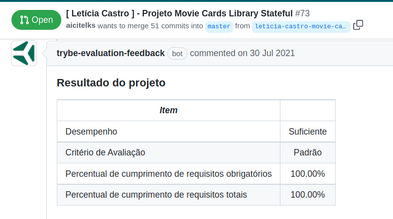

# Boas vindas ao repositório do projeto de Movie Cards Library Stateful!

## Projeto 11 🚀

**Bloco 12** - Componentes com Estado, Eventos e Formulários com React

## Habilidades desenvolvidas

  - Ler o estado de um componente e usá-lo para alterar o que exibimos no browser
  - Inicializar um componente, dando a ele um estado pré-definido
  - Atualizar o estado de um componente
  - Capturar eventos utilizando a sintaxe do React
  - Criar formulários utilizando sintaxe JSX com as tags : `input`, `textarea`, `select`, `form`
  - Transmitir informações de componentes filhos para componentes pais via callbacks

## O que foi desenvolvido

Foi desenvolvido uma aplicação que consiste em uma biblioteca de cartões de filmes dinâmica utilizando React. A biblioteca é composta por:

* Um cabeçalho;

* Uma barra de busca, utilizada pra filtrar quais cartões serão exibidos na lista de cartões;

* Uma lista de cartões, onde cada cartão representa um filme e possui uma imagem, título, subtítulo, sinopse e avaliação;

* Um formulário para adicionar um novo cartão na biblioteca.

Uma possível implementação dessa biblioteca consta abaixo.


###### Foto: @Tryber

foi realizada a implementação dos componentes que em conjunto resultaram na biblioteca de cartões de filmes dinâmica.

## Desenvolvimento

Aplicação **React** composta por um `conjunto de componentes` React e controlada por estados.

# Instruções

1. Clone o repositório
  * `git clone git@github.com:aicitelks/project-movie-cards-library-stateful.git`.
  * Entre na pasta do repositório que você acabou de clonar:
    * `cd movie-cards-library-stateful`

2. Instale as dependências e inicialize o projeto
  * Instale as dependências:
    * `npm install`
  * Inicialize o projeto:
    * `npm start` (uma nova página deve abrir no seu navegador)

## Componentes

Esse projeto contém os seguintes `React Components`:

   - Header
   - MovieLibrary
   - SearchBar
   - MovieList
   - MovieCard
   - Rating
   - AddMovie

## Estado de componentes

Os componentes que **precisam** ter estado a ser gerenciado são:

   - MovieLibrary
   - AddMovie

---

## Linter

Para garantir a qualidade do código, vamos utilizar neste projeto os linters `ESLint` e `StyleLint`.
Assim o código estará alinhado com as boas práticas de desenvolvimento, sendo mais legível
e de fácil manutenção! Para roda-los localmente no projeto, execute os comandos abaixo:

```bash
npm run lint
npm run lint:styles
```

---

#### Por **Letícia Castro**
Para visualizar o meu **Pull Request** aberto no repositório da Trybe e tomar nota da avaliação e dos testes, acesse: [pull/73](https://github.com/tryber/sd-013-b-project-movie-cards-library-stateful/pull/73) 😀



### Contato:
:large_blue_circle: [LinkedIn](https://www.linkedin.com/in/leticiacastro87/)
